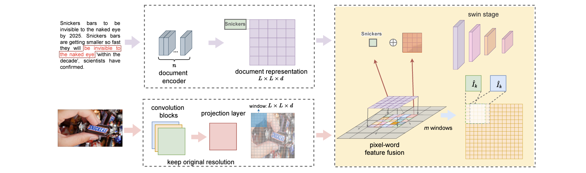
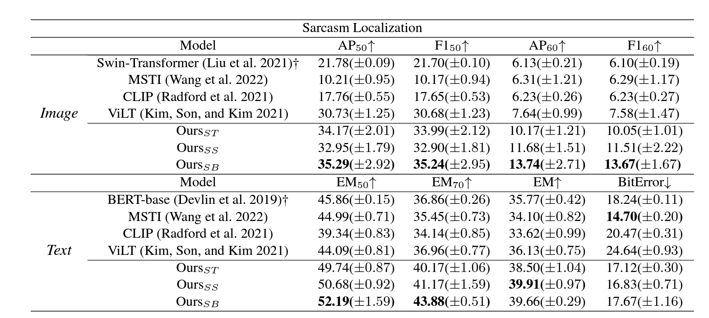
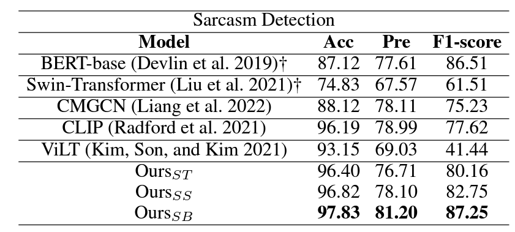

# DocMSU: A Comprehensive Benchmark for Document-level Multimodal Sarcasm Understanding
This repo is the official dataset and Pytorch implementation of [DocMSU: A Comprehensive Benchmark for Document-level Multimodal Sarcasm Understanding](https://arxiv.org/abs/2312.16023) [AAAI2024].  
**Maintaining - We will complete the repo within a week.**
## DocMSU
### Introduction
In document-level news, sarcasm clues are sparse or small and are often concealed in long text. 
Moreover, compared to sentence-level comments like tweets, which mainly focus on only a few trends or hot topics (e.g., sports events), content in the news is considerably diverse.  
Models created for sentence-level MSU may fail to capture sarcasm clues in document-level news. 
To fill this gap, we present a comprehensive benchmark for Document-level Multimodal Sarcasm Understanding (DocMSU). 

### DocMSU Dataset
A new benchmarkthat contains high-quality annotations of 102,588 pieces of news with text-image pairs in 9 hot topics.

### Method

We use the pre-trained BERT to generate contextualized token-level representations of the document and then form a document 
matrix of size L^L with a padding mechanism. We rely on a simplified Resnet to output image representations and a projection
layer to spilt the representations of an image window into L^L patches. We add patches of each image window to the document 
matrix to fuse the two modalities. The fused representations are fed to Swin-Transformer to patch attentions with a sliding window.
### Experiments
To evaluate our model, we perform two MSU tasks, i.e., sarcasm detection and sarcasm localization.


## Get Started
```
git clone https://github.com/fesvhtr/DocMSU.git
cd DocMSU
conda create -n docmsu python=3.8
pip install -r requirements.txt
conda activate docmsu
```
`./run.sh` to train and evaluate the model.
## Dataset Download
Please download the dataset from [here](https://drive.google.com/drive/folders/1g4jI9ZVGtNd3pXm7y7cZkimDur5u50Fq?usp=sharing). Here are two files: `img.zip`, `anno.zip` (Images and annotation files).  
Put them into `./DocMSU/data/release/` and unzip all.
## Checkpoints
Download checkpoint `swin_base_patch4_window7_224.pth` `swin_small_patch4_window7_224.pth` `swin_tiny_patch4_window7_224.pth` for swin-transformer [here](https://github.com/microsoft/Swin-Transformer).  
Download recommended `textmodel_8.pth` `visualmodel_8.pth` checkpoint for DocMSU [here](https://drive.google.com/drive/folders/14wJpFtwDyH3xm23OASGTvQSlFbnPcfA8?usp=sharing).
## Acknowledgments
This work was partially supported by the joint funds for Regional Innovation and Development of the National Natural Science Foundation of China (No. U21A20449), the Beijing Natural Science Foundation under Grant M21037, and the Fundamental Research Funds for the Central Universities under Grant 2242022k60006.
Please cite using this BibTeX:
```
@misc{du2023docmsu,
      title={DocMSU: A Comprehensive Benchmark for Document-level Multimodal Sarcasm Understanding}, 
      author={Hang Du and Guoshun Nan and Sicheng Zhang and Binzhu Xie and Junrui Xu and Hehe Fan and Qimei Cui and Xiaofeng Tao and Xudong Jiang},
      year={2023},
      eprint={2312.16023},
      archivePrefix={arXiv},
      primaryClass={cs.CL}
}
```
## License
DocMSU is licensed under a [Creative Commons Attribution-NonCommercial-ShareAlike 4.0 International License](https://creativecommons.org/licenses/by-nc-sa/4.0/) (CC BY-NC-SA 4.0).